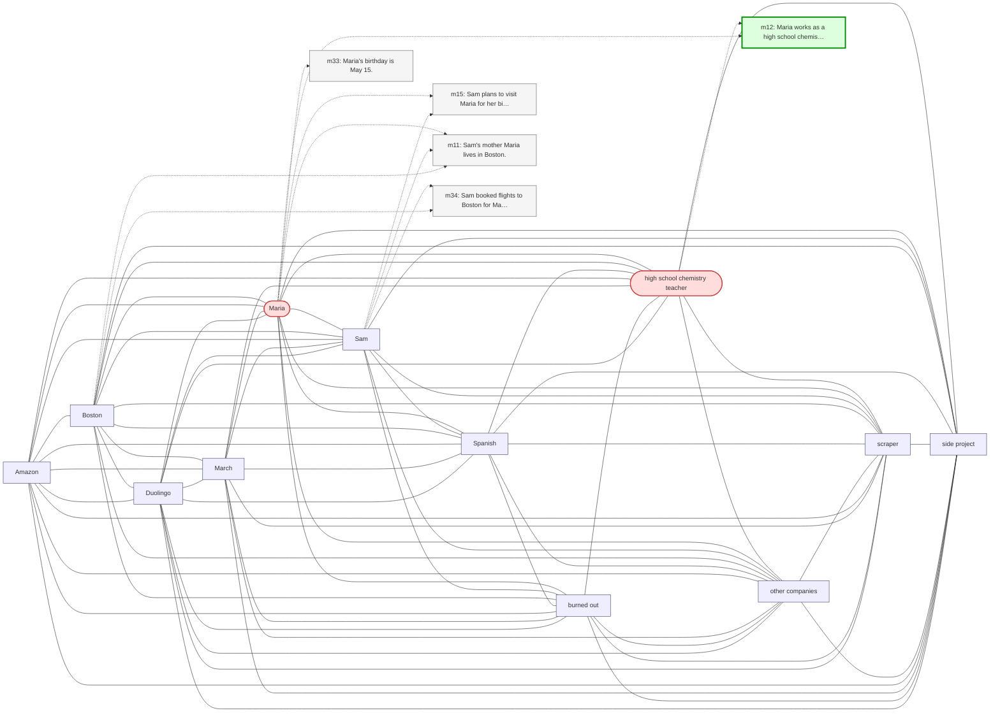

# Trace — q02  [single_hop, expect=tie]

**Question:** What is Maria's profession?

**Expected answer:** high school chemistry teacher

**Required facts:** ['m12']

## Step 1 — query→triple top-K (cosine on triple-text embeddings)

| Cosine | Subject | Predicate | Object |
|---|---|---|---|
| 0.523 | `Maria` | works as | `high school chemistry teacher` |
| 0.461 | `Maria` | has birthday in | `May` |
| 0.458 | `Maria` | has birthday on | `May 15` |
| 0.450 | `Maria's birthday` | is on | `May 13` |
| 0.436 | `Maria` | lives in | `Boston` |
| 0.427 | `Maria's birthday` | is in | `Boston` |
| 0.351 | `David` | will attend | `Maria's birthday` |
| 0.327 | `Sam` | plans to visit | `Maria` |
| 0.326 | `Sam` | is going to be there for | `Maria's birthday` |
| 0.323 | `Sam` | has mother | `Maria` |

## Step 2 — recognition memory (LLM filter)

| Subject | Predicate | Object |
|---|---|---|
| `Maria` | works as | `high school chemistry teacher` |

## Step 3 — top 5 retrieved passages

| Rank | Memory | PPR | Hit | Text |
|---|---|---|---|---|
| 1 | `m12` | 0.00561 | ✓ | Maria works as a high school chemistry teacher. |
| 2 | `m15` | 0.00340 |  | Sam plans to visit Maria for her birthday in mid-May. |
| 3 | `m33` | 0.00327 |  | Maria's birthday is May 15. |
| 4 | `m11` | 0.00308 |  | Sam's mother Maria lives in Boston. |
| 5 | `m34` | 0.00255 |  | Sam booked flights to Boston for May 13 through 17 to be the… |

## Search subgraph

Seeds from filtered triples (red), top-PPR phrases (blue), top-5 passage nodes (green if required, grey otherwise).

