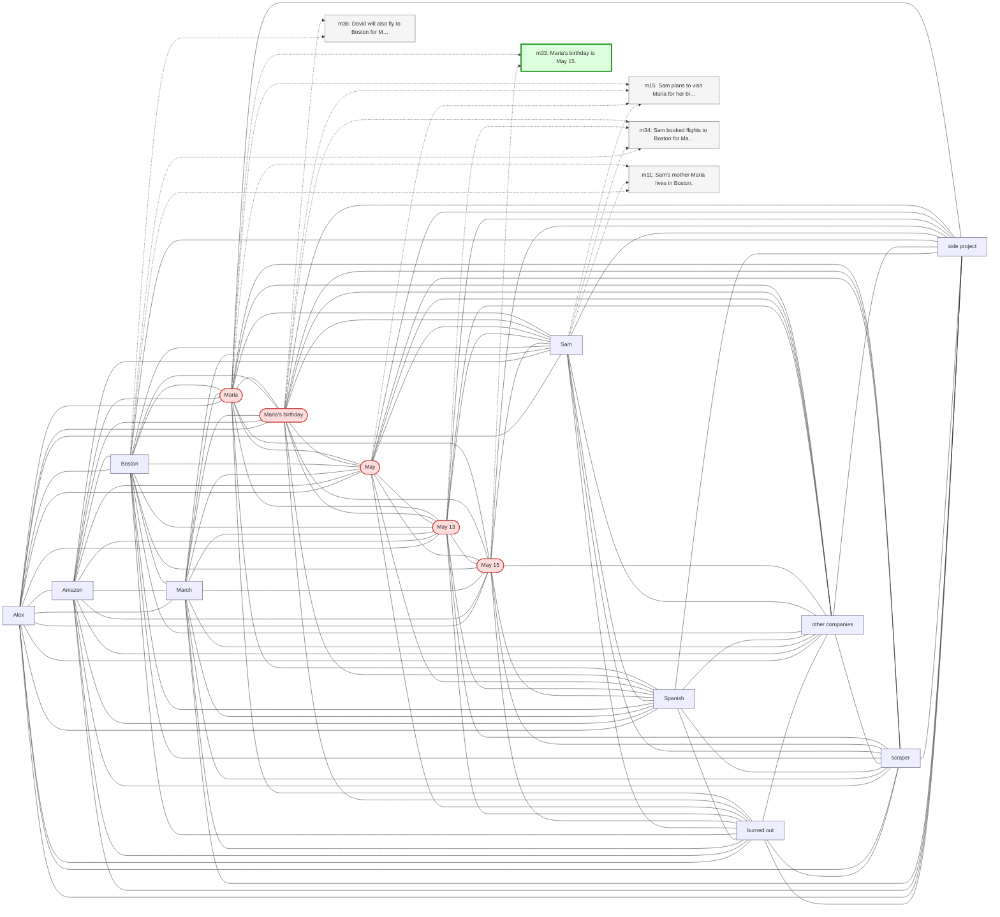

# Trace — q03  [single_hop, expect=tie]

**Question:** When is Maria's birthday?

**Expected answer:** May 15

**Required facts:** ['m33']

## Step 1 — query→triple top-K (cosine on triple-text embeddings)

| Cosine | Subject | Predicate | Object |
|---|---|---|---|
| 0.590 | `Maria` | has birthday on | `May 15` |
| 0.588 | `Maria` | has birthday in | `May` |
| 0.583 | `Maria's birthday` | is in | `Boston` |
| 0.577 | `Maria's birthday` | is on | `May 13` |
| 0.443 | `David` | will attend | `Maria's birthday` |
| 0.414 | `Maria` | works as | `high school chemistry teacher` |
| 0.412 | `Maria` | lives in | `Boston` |
| 0.406 | `Sam` | is going to be there for | `Maria's birthday` |
| 0.368 | `Sam` | visiting for | `Maria's birthday` |
| 0.334 | `Sam` | plans to visit | `Maria` |

## Step 2 — recognition memory (LLM filter)

| Subject | Predicate | Object |
|---|---|---|
| `Maria` | has birthday on | `May 15` |
| `Maria` | has birthday in | `May` |
| `Maria's birthday` | is on | `May 13` |

## Step 3 — top 5 retrieved passages

| Rank | Memory | PPR | Hit | Text |
|---|---|---|---|---|
| 1 | `m15` | 0.00367 |  | Sam plans to visit Maria for her birthday in mid-May. |
| 2 | `m34` | 0.00357 |  | Sam booked flights to Boston for May 13 through 17 to be the… |
| 3 | `m33` | 0.00289 | ✓ | Maria's birthday is May 15. |
| 4 | `m11` | 0.00209 |  | Sam's mother Maria lives in Boston. |
| 5 | `m36` | 0.00203 |  | David will also fly to Boston for Maria's birthday. |

## Search subgraph

Seeds from filtered triples (red), top-PPR phrases (blue), top-5 passage nodes (green if required, grey otherwise).

