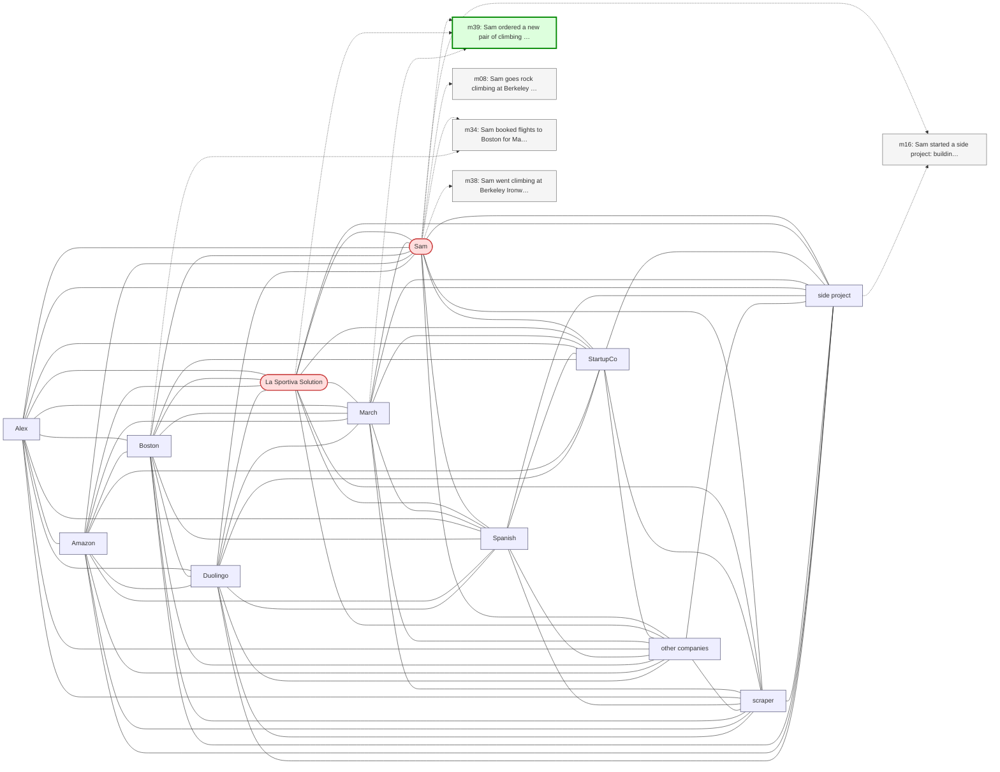

# Trace — q04  [single_hop, expect=tie]

**Question:** What climbing shoes did Sam order?

**Expected answer:** La Sportiva Solution

**Required facts:** ['m39']

## Step 1 — query→triple top-K (cosine on triple-text embeddings)

| Cosine | Subject | Predicate | Object |
|---|---|---|---|
| 0.551 | `Sam` | went climbing at | `Berkeley Ironworks` |
| 0.530 | `Sam` | climbed at | `Yosemite` |
| 0.509 | `Sam` | ordered | `La Sportiva Solution` |
| 0.504 | `Sam` | has favorite climbing problems | `V4-V5 boulder routes` |
| 0.500 | `Sam` | climbed with | `Alex` |
| 0.494 | `Sam` | goes rock climbing at | `Berkeley Ironworks` |
| 0.470 | `Sam` | has been doing | `rock climbing` |
| 0.466 | `Sam` | has goal | `discover new outdoor climbing destinations` |
| 0.413 | `Sam` | decided to rewrite | `climbing scraper` |
| 0.394 | `Sam` | booked flights to | `Boston` |

## Step 2 — recognition memory (LLM filter)

| Subject | Predicate | Object |
|---|---|---|
| `Sam` | ordered | `La Sportiva Solution` |

## Step 3 — top 5 retrieved passages

| Rank | Memory | PPR | Hit | Text |
|---|---|---|---|---|
| 1 | `m39` | 0.00553 | ✓ | Sam ordered a new pair of climbing shoes — the La Sportiva S… |
| 2 | `m08` | 0.00339 |  | Sam goes rock climbing at Berkeley Ironworks gym. |
| 3 | `m34` | 0.00334 |  | Sam booked flights to Boston for May 13 through 17 to be the… |
| 4 | `m38` | 0.00332 |  | Sam went climbing at Berkeley Ironworks this morning, first … |
| 5 | `m16` | 0.00315 |  | Sam started a side project: building a web scraper to find n… |

## Search subgraph

Seeds from filtered triples (red), top-PPR phrases (blue), top-5 passage nodes (green if required, grey otherwise).

