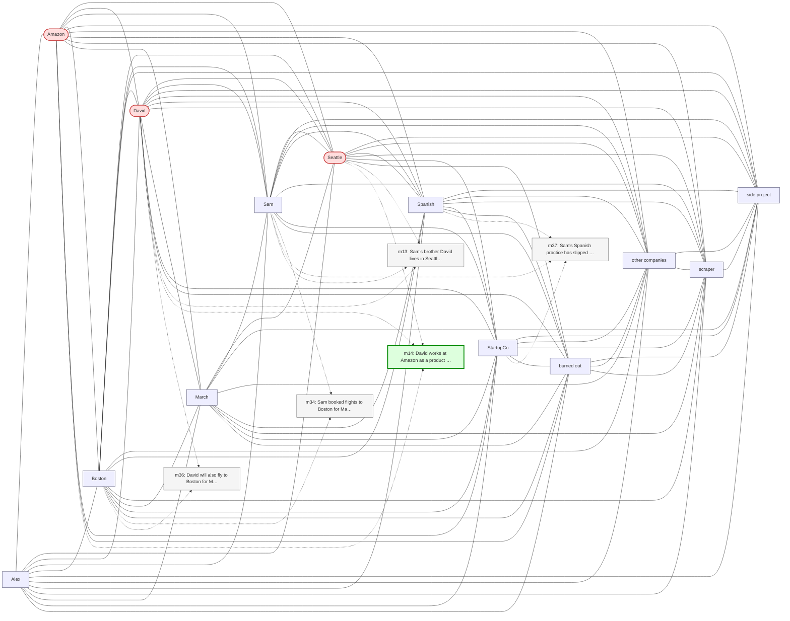

# Trace — q05  [two_hop, expect=tie]

**Question:** In which city is the company that David works for headquartered?

**Expected answer:** Seattle

**Required facts:** ['m14']

## Step 1 — query→triple top-K (cosine on triple-text embeddings)

| Cosine | Subject | Predicate | Object |
|---|---|---|---|
| 0.496 | `David` | has office at | `Seattle` |
| 0.472 | `David` | works at | `Amazon` |
| 0.439 | `David` | lives in | `Seattle` |
| 0.348 | `David` | will attend | `Maria's birthday` |
| 0.339 | `David` | will fly to | `Boston` |
| 0.332 | `Sam` | works at | `TechCorp` |
| 0.332 | `Sam` | works at | `TechCorp` |
| 0.332 | `Sam` | works at | `TechCorp` |
| 0.331 | `Sam` | works at | `StartupCo` |
| 0.331 | `Sam` | works at | `StartupCo` |

## Step 2 — recognition memory (LLM filter)

| Subject | Predicate | Object |
|---|---|---|
| `David` | works at | `Amazon` |
| `David` | has office at | `Seattle` |

## Step 3 — top 5 retrieved passages

| Rank | Memory | PPR | Hit | Text |
|---|---|---|---|---|
| 1 | `m14` | 0.00427 | ✓ | David works at Amazon as a product manager. His office is at… |
| 2 | `m13` | 0.00337 |  | Sam's brother David lives in Seattle. |
| 3 | `m36` | 0.00267 |  | David will also fly to Boston for Maria's birthday. |
| 4 | `m34` | 0.00210 |  | Sam booked flights to Boston for May 13 through 17 to be the… |
| 5 | `m37` | 0.00176 |  | Sam's Spanish practice has slipped to once a week since star… |

## Search subgraph

Seeds from filtered triples (red), top-PPR phrases (blue), top-5 passage nodes (green if required, grey otherwise).

