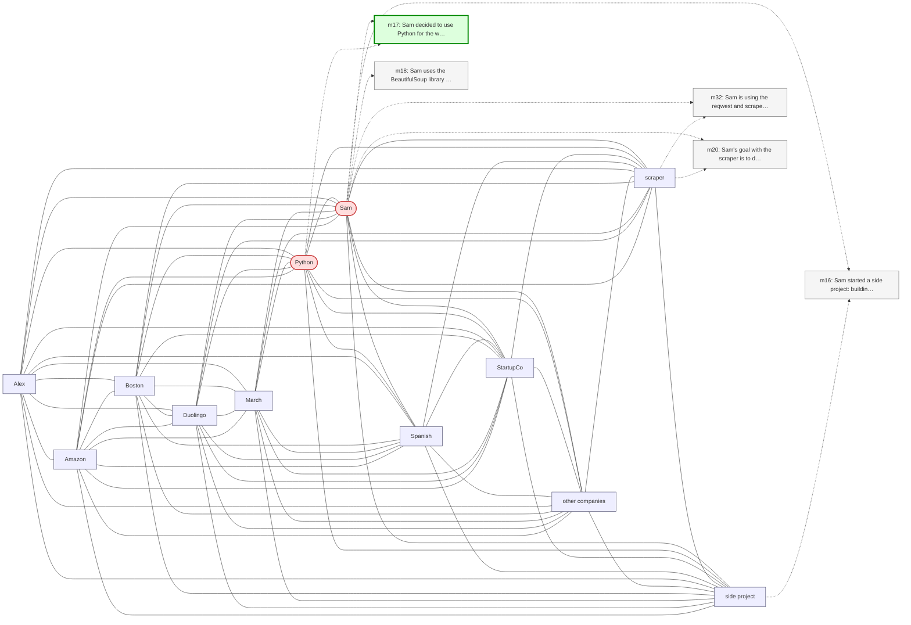

# Trace — q06  [two_hop, expect=tie]

**Question:** What programming language does Sam's web scraper use?

**Expected answer:** Python (initially), then rewritten in Rust

**Required facts:** ['m17', 'm31']

## Step 1 — query→triple top-K (cosine on triple-text embeddings)

| Cosine | Subject | Predicate | Object |
|---|---|---|---|
| 0.555 | `Sam` | worked on | `web scraper project` |
| 0.540 | `Sam` | uses | `scraper` |
| 0.515 | `Sam` | uses | `BeautifulSoup` |
| 0.503 | `scraper` | is written in | `Rust` |
| 0.494 | `Sam` | uses | `Duolingo` |
| 0.493 | `Sam` | is using | `scraper` |
| 0.472 | `Sam` | decided to rewrite | `climbing scraper` |
| 0.468 | `Sam` | decided to use | `Python` |
| 0.453 | `Sam` | practices | `Spanish` |
| 0.453 | `Sam` | practices | `Spanish` |

## Step 2 — recognition memory (LLM filter)

| Subject | Predicate | Object |
|---|---|---|
| `Sam` | decided to use | `Python` |

## Step 3 — top 5 retrieved passages

| Rank | Memory | PPR | Hit | Text |
|---|---|---|---|---|
| 1 | `m17` | 0.00437 | ✓ | Sam decided to use Python for the web scraper project. |
| 2 | `m32` | 0.00358 |  | Sam is using the reqwest and scraper crates for the Rust ver… |
| 3 | `m16` | 0.00318 |  | Sam started a side project: building a web scraper to find n… |
| 4 | `m20` | 0.00310 |  | Sam's goal with the scraper is to discover new outdoor climb… |
| 5 | `m18` | 0.00308 |  | Sam uses the BeautifulSoup library for parsing HTML in the s… |

## Search subgraph

Seeds from filtered triples (red), top-PPR phrases (blue), top-5 passage nodes (green if required, grey otherwise).

