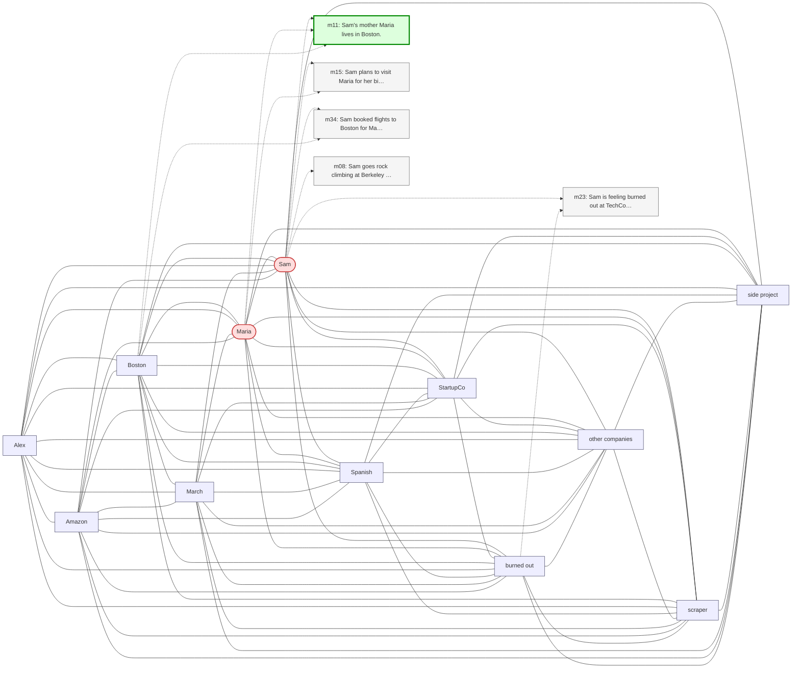

# Trace — q07  [two_hop, expect=tie]

**Question:** What does Sam's mother do for a living, and where does she live?

**Expected answer:** high school chemistry teacher in Boston

**Required facts:** ['m11', 'm12']

## Step 1 — query→triple top-K (cosine on triple-text embeddings)

| Cosine | Subject | Predicate | Object |
|---|---|---|---|
| 0.444 | `Sam` | has mother | `Maria` |
| 0.415 | `Sam` | lives in | `Oakland` |
| 0.414 | `Sam` | works at | `TechCorp` |
| 0.414 | `Sam` | works at | `TechCorp` |
| 0.414 | `Sam` | works at | `TechCorp` |
| 0.407 | `Sam` | lives in | `California` |
| 0.399 | `Sam` | works at | `StartupCo` |
| 0.399 | `Sam` | works at | `StartupCo` |
| 0.372 | `Sam` | has manager | `Jennifer` |
| 0.365 | `Sam` | practices | `Spanish` |

## Step 2 — recognition memory (LLM filter)

| Subject | Predicate | Object |
|---|---|---|
| `Sam` | has mother | `Maria` |

## Step 3 — top 5 retrieved passages

| Rank | Memory | PPR | Hit | Text |
|---|---|---|---|---|
| 1 | `m11` | 0.00419 | ✓ | Sam's mother Maria lives in Boston. |
| 2 | `m15` | 0.00390 |  | Sam plans to visit Maria for her birthday in mid-May. |
| 3 | `m34` | 0.00307 |  | Sam booked flights to Boston for May 13 through 17 to be the… |
| 4 | `m08` | 0.00292 |  | Sam goes rock climbing at Berkeley Ironworks gym. |
| 5 | `m23` | 0.00292 |  | Sam is feeling burned out at TechCorp due to long hours and … |

## Search subgraph

Seeds from filtered triples (red), top-PPR phrases (blue), top-5 passage nodes (green if required, grey otherwise).

