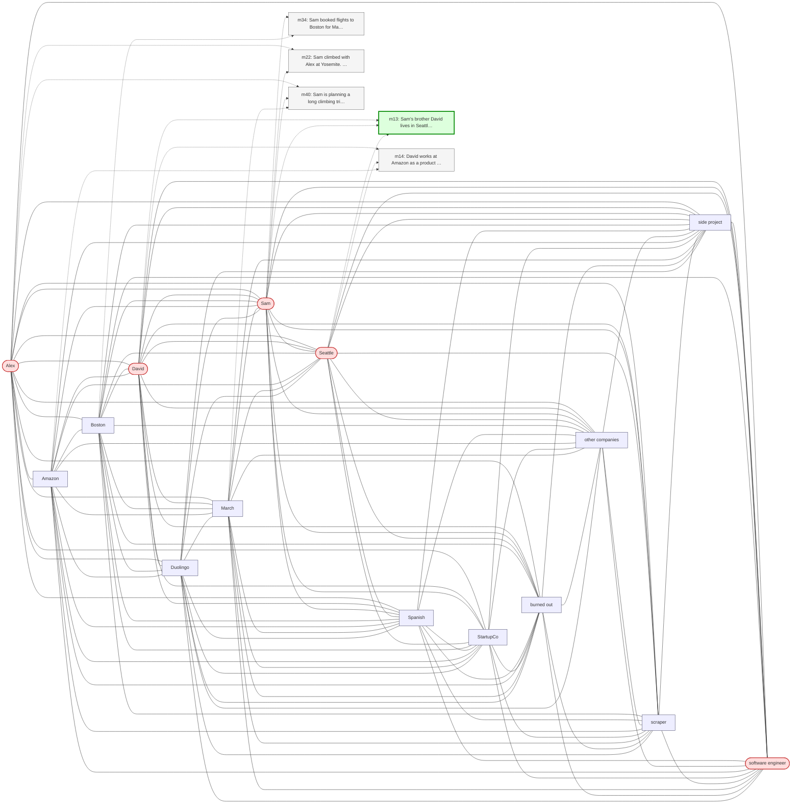

# Trace — q09  [deep_multi_hop, expect=HippoRAG]

**Question:** What is the profession of the partner of the engineer who has a brother in Seattle?

**Expected answer:** graphic designer

**Required facts:** ['m05', 'm13']

## Step 1 — query→triple top-K (cosine on triple-text embeddings)

| Cosine | Subject | Predicate | Object |
|---|---|---|---|
| 0.386 | `Amazon` | has headquarters at | `Seattle` |
| 0.378 | `David` | has office at | `Seattle` |
| 0.352 | `Sam` | has partner | `Alex` |
| 0.347 | `Sam` | is | `software engineer` |
| 0.330 | `Sam` | works at | `TechCorp` |
| 0.330 | `Sam` | works at | `TechCorp` |
| 0.330 | `Sam` | works at | `TechCorp` |
| 0.327 | `David` | lives in | `Seattle` |
| 0.326 | `David` | works at | `Amazon` |
| 0.323 | `David` | is brother of | `Sam` |

## Step 2 — recognition memory (LLM filter)

| Subject | Predicate | Object |
|---|---|---|
| `Sam` | has partner | `Alex` |
| `Sam` | is | `software engineer` |
| `David` | is brother of | `Sam` |
| `David` | lives in | `Seattle` |

## Step 3 — top 5 retrieved passages

| Rank | Memory | PPR | Hit | Text |
|---|---|---|---|---|
| 1 | `m13` | 0.00276 | ✓ | Sam's brother David lives in Seattle. |
| 2 | `m34` | 0.00240 |  | Sam booked flights to Boston for May 13 through 17 to be the… |
| 3 | `m22` | 0.00217 |  | Sam climbed with Alex at Yosemite. Alex is also a climber bu… |
| 4 | `m40` | 0.00217 |  | Sam is planning a long climbing trip to Joshua Tree in late … |
| 5 | `m14` | 0.00213 |  | David works at Amazon as a product manager. His office is at… |

## Search subgraph

Seeds from filtered triples (red), top-PPR phrases (blue), top-5 passage nodes (green if required, grey otherwise).

