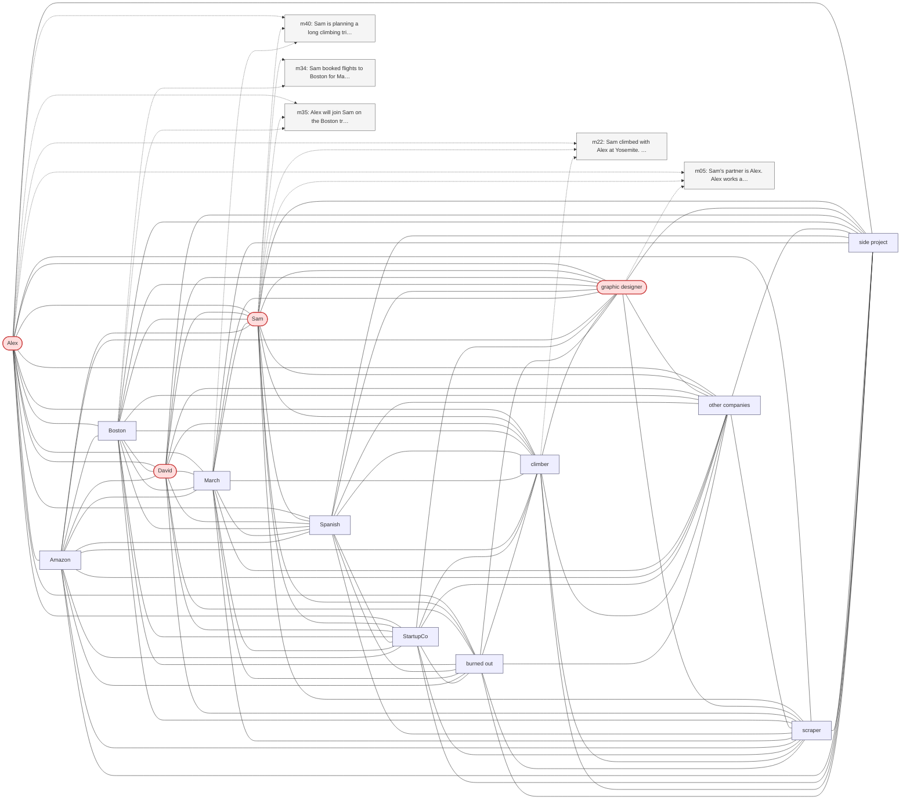

# Trace — q10  [deep_multi_hop, expect=tie]

**Question:** In which city was the person born who is married to the graphic designer's partner's brother?

**Expected answer:** unknown / cannot determine (Maria's birth location is not in the facts)

**Required facts:** (none — absence/abstention)

## Step 1 — query→triple top-K (cosine on triple-text embeddings)

| Cosine | Subject | Predicate | Object |
|---|---|---|---|
| 0.338 | `Sam` | has partner | `Alex` |
| 0.315 | `Alex` | works as | `graphic designer` |
| 0.260 | `Sam` | is | `software engineer` |
| 0.259 | `David` | is brother of | `Sam` |
| 0.256 | `David` | has office at | `Seattle` |
| 0.251 | `David` | will attend | `Maria's birthday` |
| 0.245 | `Alex` | will accompany | `Sam` |
| 0.242 | `Sam` | has mother | `Maria` |
| 0.237 | `Jennifer` | works at | `TechCorp` |
| 0.237 | `Sam` | has manager | `Jennifer` |

## Step 2 — recognition memory (LLM filter)

| Subject | Predicate | Object |
|---|---|---|
| `David` | is brother of | `Sam` |
| `Sam` | has partner | `Alex` |
| `Alex` | works as | `graphic designer` |

## Step 3 — top 5 retrieved passages

| Rank | Memory | PPR | Hit | Text |
|---|---|---|---|---|
| 1 | `m05` | 0.00313 |  | Sam's partner is Alex. Alex works as a graphic designer. |
| 2 | `m40` | 0.00260 |  | Sam is planning a long climbing trip to Joshua Tree in late … |
| 3 | `m22` | 0.00256 |  | Sam climbed with Alex at Yosemite. Alex is also a climber bu… |
| 4 | `m34` | 0.00241 |  | Sam booked flights to Boston for May 13 through 17 to be the… |
| 5 | `m35` | 0.00230 |  | Alex will join Sam on the Boston trip. |

## Search subgraph

Seeds from filtered triples (red), top-PPR phrases (blue), top-5 passage nodes (green if required, grey otherwise).

