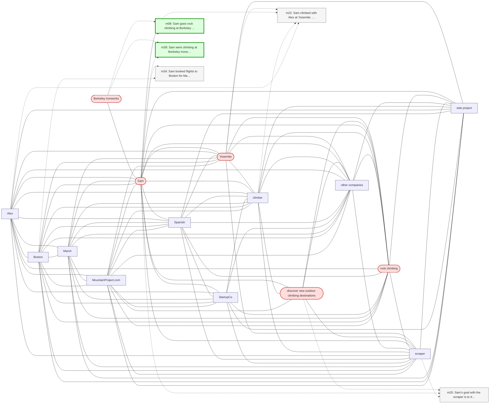

# Trace — q11  [implicit_conceptual, expect=A-Mem]

**Question:** What outdoor activities does Sam enjoy?

**Expected answer:** rock climbing (Yosemite, Joshua Tree, Berkeley Ironworks — though gym is indoor)

**Required facts:** ['m08', 'm21', 'm40', 'm38']

## Step 1 — query→triple top-K (cosine on triple-text embeddings)

| Cosine | Subject | Predicate | Object |
|---|---|---|---|
| 0.533 | `Sam` | has goal | `discover new outdoor climbing destinations` |
| 0.508 | `Sam` | has been doing | `rock climbing` |
| 0.494 | `Sam` | went climbing at | `Berkeley Ironworks` |
| 0.478 | `Sam` | climbed at | `Yosemite` |
| 0.462 | `Sam` | goes rock climbing at | `Berkeley Ironworks` |
| 0.454 | `Sam` | has favorite climbing problems | `V4-V5 boulder routes` |
| 0.433 | `Sam` | uses | `Duolingo` |
| 0.413 | `Sam` | practices | `Spanish` |
| 0.413 | `Sam` | practices | `Spanish` |
| 0.412 | `Sam` | lives in | `California` |

## Step 2 — recognition memory (LLM filter)

| Subject | Predicate | Object |
|---|---|---|
| `Sam` | has goal | `discover new outdoor climbing destinations` |
| `Sam` | has been doing | `rock climbing` |
| `Sam` | went climbing at | `Berkeley Ironworks` |
| `Sam` | climbed at | `Yosemite` |

## Step 3 — top 5 retrieved passages

| Rank | Memory | PPR | Hit | Text |
|---|---|---|---|---|
| 1 | `m08` | 0.00891 | ✓ | Sam goes rock climbing at Berkeley Ironworks gym. |
| 2 | `m38` | 0.00883 | ✓ | Sam went climbing at Berkeley Ironworks this morning, first … |
| 3 | `m20` | 0.00385 |  | Sam's goal with the scraper is to discover new outdoor climb… |
| 4 | `m22` | 0.00284 |  | Sam climbed with Alex at Yosemite. Alex is also a climber bu… |
| 5 | `m34` | 0.00265 |  | Sam booked flights to Boston for May 13 through 17 to be the… |

## Search subgraph

Seeds from filtered triples (red), top-PPR phrases (blue), top-5 passage nodes (green if required, grey otherwise).

