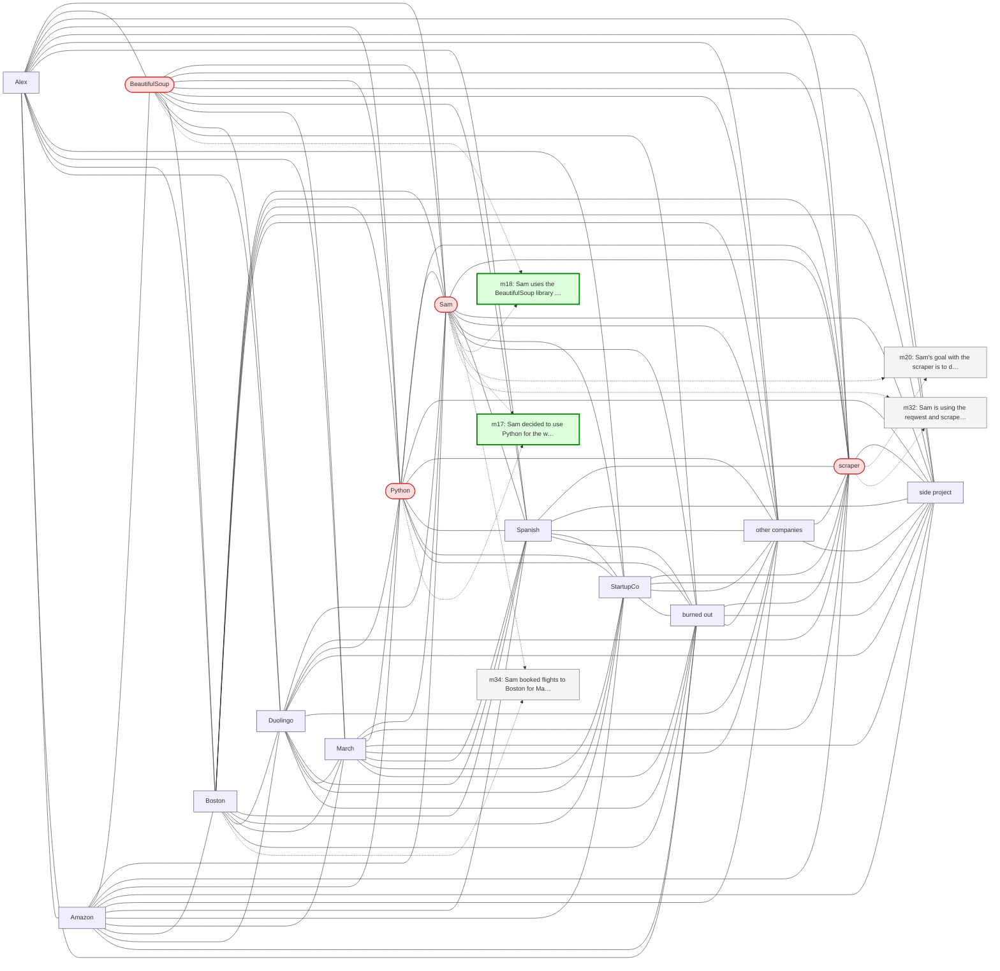

# Trace — q12  [implicit_conceptual, expect=A-Mem]

**Question:** What Python libraries has Sam used?

**Expected answer:** BeautifulSoup

**Required facts:** ['m17', 'm18']

## Step 1 — query→triple top-K (cosine on triple-text embeddings)

| Cosine | Subject | Predicate | Object |
|---|---|---|---|
| 0.556 | `Sam` | uses | `BeautifulSoup` |
| 0.547 | `Sam` | worked on | `web scraper project` |
| 0.528 | `Sam` | uses | `scraper` |
| 0.513 | `Sam` | uses | `Duolingo` |
| 0.497 | `Sam` | decided to use | `Python` |
| 0.460 | `Sam` | is | `software engineer` |
| 0.454 | `Sam` | has role | `senior backend engineer` |
| 0.448 | `Sam` | is using | `scraper` |
| 0.440 | `Sam` | interviewed at | `developer-tools startups` |
| 0.439 | `Sam` | started at | `StartupCo` |

## Step 2 — recognition memory (LLM filter)

| Subject | Predicate | Object |
|---|---|---|
| `Sam` | uses | `BeautifulSoup` |
| `Sam` | uses | `scraper` |
| `Sam` | decided to use | `Python` |

## Step 3 — top 5 retrieved passages

| Rank | Memory | PPR | Hit | Text |
|---|---|---|---|---|
| 1 | `m32` | 0.00299 |  | Sam is using the reqwest and scraper crates for the Rust ver… |
| 2 | `m18` | 0.00275 | ✓ | Sam uses the BeautifulSoup library for parsing HTML in the s… |
| 3 | `m20` | 0.00270 |  | Sam's goal with the scraper is to discover new outdoor climb… |
| 4 | `m17` | 0.00259 | ✓ | Sam decided to use Python for the web scraper project. |
| 5 | `m34` | 0.00256 |  | Sam booked flights to Boston for May 13 through 17 to be the… |

## Search subgraph

Seeds from filtered triples (red), top-PPR phrases (blue), top-5 passage nodes (green if required, grey otherwise).

