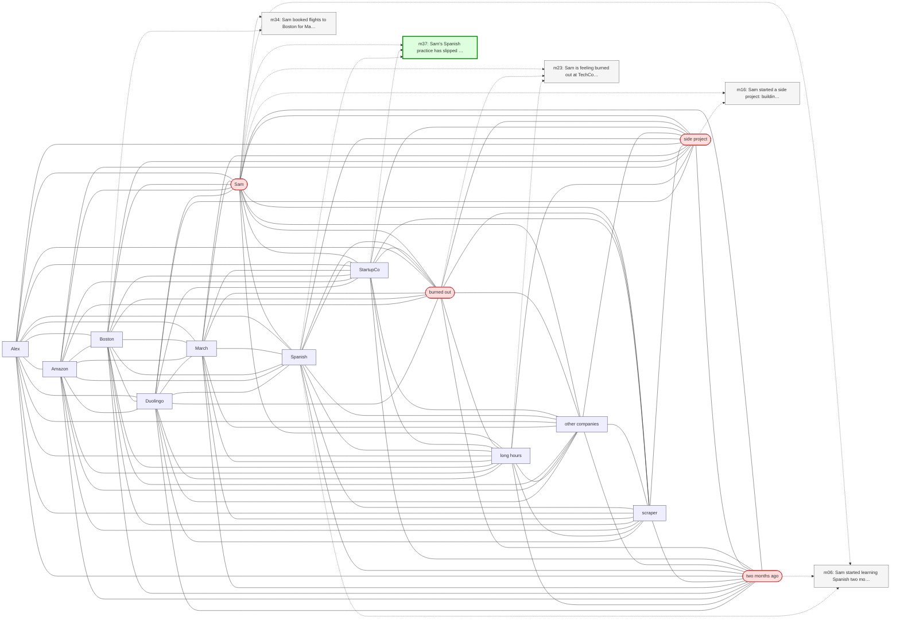

# Trace — q13  [implicit_conceptual, expect=A-Mem]

**Question:** What hobbies has Sam been less active in lately?

**Expected answer:** Spanish learning (slipped to once a week) and climbing (first session in two weeks before m38)

**Required facts:** ['m37', 'm38']

## Step 1 — query→triple top-K (cosine on triple-text embeddings)

| Cosine | Subject | Predicate | Object |
|---|---|---|---|
| 0.522 | `Sam` | has been doing | `rock climbing` |
| 0.448 | `Sam` | went climbing at | `Berkeley Ironworks` |
| 0.431 | `Sam` | started learning Spanish | `two months ago` |
| 0.424 | `Sam` | has goal | `discover new outdoor climbing destinations` |
| 0.414 | `Sam` | has favorite climbing problems | `V4-V5 boulder routes` |
| 0.413 | `Sam` | goes rock climbing at | `Berkeley Ironworks` |
| 0.408 | `Sam` | uses | `Duolingo` |
| 0.401 | `Sam` | started | `side project` |
| 0.400 | `Sam` | feeling | `burned out` |
| 0.398 | `Sam` | gave notice at | `TechCorp` |

## Step 2 — recognition memory (LLM filter)

| Subject | Predicate | Object |
|---|---|---|
| `Sam` | started learning Spanish | `two months ago` |
| `Sam` | started | `side project` |
| `Sam` | feeling | `burned out` |

## Step 3 — top 5 retrieved passages

| Rank | Memory | PPR | Hit | Text |
|---|---|---|---|---|
| 1 | `m23` | 0.00299 |  | Sam is feeling burned out at TechCorp due to long hours and … |
| 2 | `m16` | 0.00284 |  | Sam started a side project: building a web scraper to find n… |
| 3 | `m34` | 0.00268 |  | Sam booked flights to Boston for May 13 through 17 to be the… |
| 4 | `m06` | 0.00263 |  | Sam started learning Spanish two months ago, mainly for an u… |
| 5 | `m37` | 0.00252 | ✓ | Sam's Spanish practice has slipped to once a week since star… |

## Search subgraph

Seeds from filtered triples (red), top-PPR phrases (blue), top-5 passage nodes (green if required, grey otherwise).

