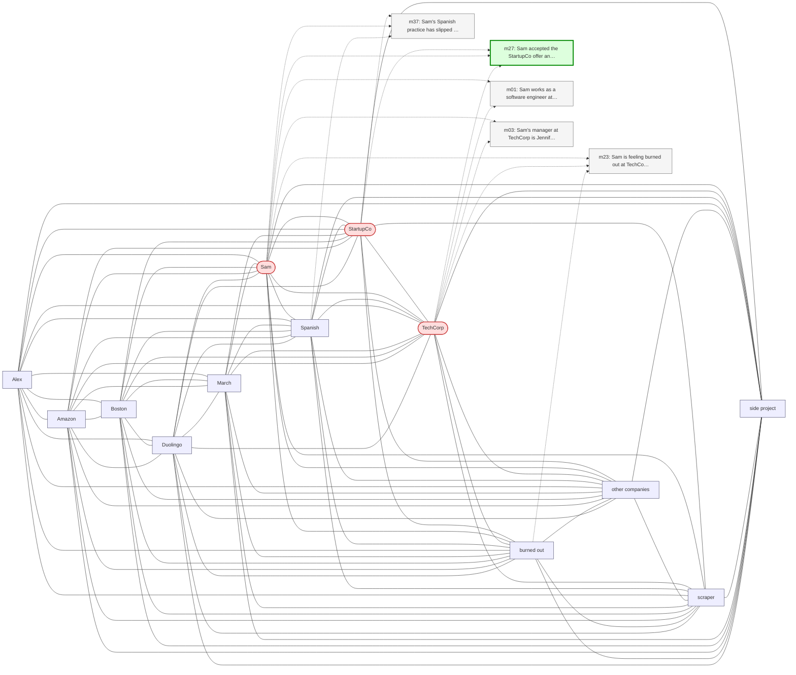

# Trace — q14  [information_update, expect=A-Mem]

**Question:** Where does Sam currently work?

**Expected answer:** StartupCo

**Required facts:** ['m27', 'm29']

## Step 1 — query→triple top-K (cosine on triple-text embeddings)

| Cosine | Subject | Predicate | Object |
|---|---|---|---|
| 0.497 | `Sam` | works at | `StartupCo` |
| 0.497 | `Sam` | works at | `StartupCo` |
| 0.490 | `Sam` | works at | `TechCorp` |
| 0.490 | `Sam` | works at | `TechCorp` |
| 0.490 | `Sam` | works at | `TechCorp` |
| 0.474 | `Sam` | worked on | `web scraper project` |
| 0.471 | `Sam` | is | `software engineer` |
| 0.465 | `Sam` | lives in | `California` |
| 0.465 | `Sam` | has role | `senior backend engineer` |
| 0.450 | `Sam` | lives in | `Oakland` |

## Step 2 — recognition memory (LLM filter)

| Subject | Predicate | Object |
|---|---|---|
| `Sam` | works at | `StartupCo` |
| `Sam` | works at | `TechCorp` |

## Step 3 — top 5 retrieved passages

| Rank | Memory | PPR | Hit | Text |
|---|---|---|---|---|
| 1 | `m27` | 0.00341 | ✓ | Sam accepted the StartupCo offer and gave notice at TechCorp… |
| 2 | `m23` | 0.00336 |  | Sam is feeling burned out at TechCorp due to long hours and … |
| 3 | `m37` | 0.00314 |  | Sam's Spanish practice has slipped to once a week since star… |
| 4 | `m01` | 0.00305 |  | Sam works as a software engineer at TechCorp. |
| 5 | `m03` | 0.00285 |  | Sam's manager at TechCorp is Jennifer. |

## Search subgraph

Seeds from filtered triples (red), top-PPR phrases (blue), top-5 passage nodes (green if required, grey otherwise).

