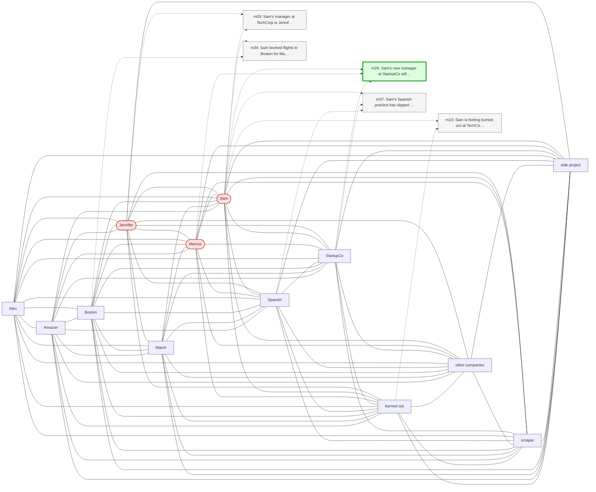

# Trace — q15  [information_update, expect=A-Mem]

**Question:** Who is Sam's current manager?

**Expected answer:** Marcus

**Required facts:** ['m28', 'm29']

## Step 1 — query→triple top-K (cosine on triple-text embeddings)

| Cosine | Subject | Predicate | Object |
|---|---|---|---|
| 0.546 | `Sam` | has manager | `Marcus` |
| 0.542 | `Sam` | has manager | `Jennifer` |
| 0.507 | `Jennifer` | is manager of | `Sam` |
| 0.507 | `Marcus` | is manager of | `Sam` |
| 0.419 | `Sam` | has role | `senior backend engineer` |
| 0.415 | `Sam` | works at | `StartupCo` |
| 0.415 | `Sam` | works at | `StartupCo` |
| 0.414 | `Sam` | uses | `Duolingo` |
| 0.413 | `Sam` | is | `software engineer` |
| 0.396 | `Sam` | has been doing | `rock climbing` |

## Step 2 — recognition memory (LLM filter)

| Subject | Predicate | Object |
|---|---|---|
| `Sam` | has manager | `Marcus` |
| `Sam` | has manager | `Jennifer` |
| `Jennifer` | is manager of | `Sam` |
| `Marcus` | is manager of | `Sam` |

## Step 3 — top 5 retrieved passages

| Rank | Memory | PPR | Hit | Text |
|---|---|---|---|---|
| 1 | `m28` | 0.00319 | ✓ | Sam's new manager at StartupCo will be Marcus. |
| 2 | `m03` | 0.00274 |  | Sam's manager at TechCorp is Jennifer. |
| 3 | `m34` | 0.00268 |  | Sam booked flights to Boston for May 13 through 17 to be the… |
| 4 | `m37` | 0.00236 |  | Sam's Spanish practice has slipped to once a week since star… |
| 5 | `m23` | 0.00234 |  | Sam is feeling burned out at TechCorp due to long hours and … |

## Search subgraph

Seeds from filtered triples (red), top-PPR phrases (blue), top-5 passage nodes (green if required, grey otherwise).

