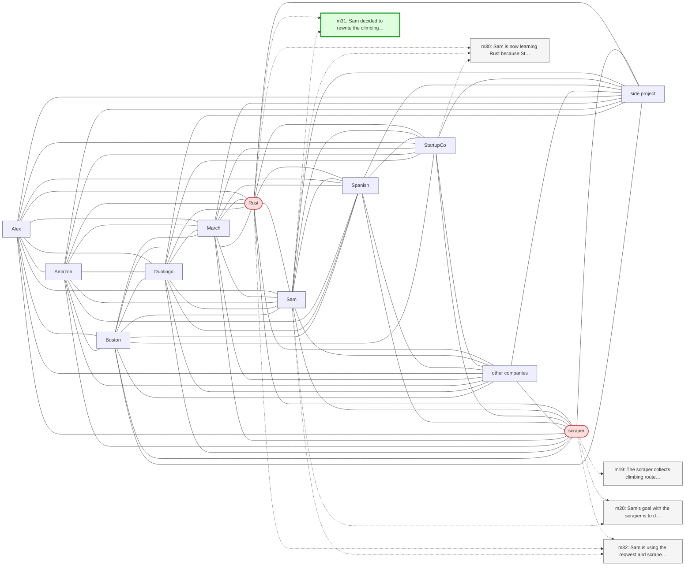

# Trace — q16  [information_update, expect=A-Mem]

**Question:** What language is Sam's climbing scraper currently written in?

**Expected answer:** Rust

**Required facts:** ['m17', 'm31']

## Step 1 — query→triple top-K (cosine on triple-text embeddings)

| Cosine | Subject | Predicate | Object |
|---|---|---|---|
| 0.596 | `Sam` | decided to rewrite | `climbing scraper` |
| 0.529 | `scraper` | is used to | `discover new outdoor climbing destinations` |
| 0.508 | `Rust` | is used for | `climbing scraper` |
| 0.506 | `scraper` | is written in | `Rust` |
| 0.489 | `web scraper` | used for | `finding new climbing destinations` |
| 0.479 | `Sam` | worked on | `web scraper project` |
| 0.479 | `Sam` | uses | `scraper` |
| 0.470 | `Sam` | has favorite climbing problems | `V4-V5 boulder routes` |
| 0.469 | `Sam` | uses | `BeautifulSoup` |
| 0.461 | `Sam` | uses | `Duolingo` |

## Step 2 — recognition memory (LLM filter)

| Subject | Predicate | Object |
|---|---|---|
| `scraper` | is written in | `Rust` |

## Step 3 — top 5 retrieved passages

| Rank | Memory | PPR | Hit | Text |
|---|---|---|---|---|
| 1 | `m32` | 0.00518 |  | Sam is using the reqwest and scraper crates for the Rust ver… |
| 2 | `m31` | 0.00397 | ✓ | Sam decided to rewrite the climbing scraper in Rust as a lea… |
| 3 | `m20` | 0.00391 |  | Sam's goal with the scraper is to discover new outdoor climb… |
| 4 | `m30` | 0.00336 |  | Sam is now learning Rust because StartupCo's main service is… |
| 5 | `m19` | 0.00317 |  | The scraper collects climbing route data from MountainProjec… |

## Search subgraph

Seeds from filtered triples (red), top-PPR phrases (blue), top-5 passage nodes (green if required, grey otherwise).

