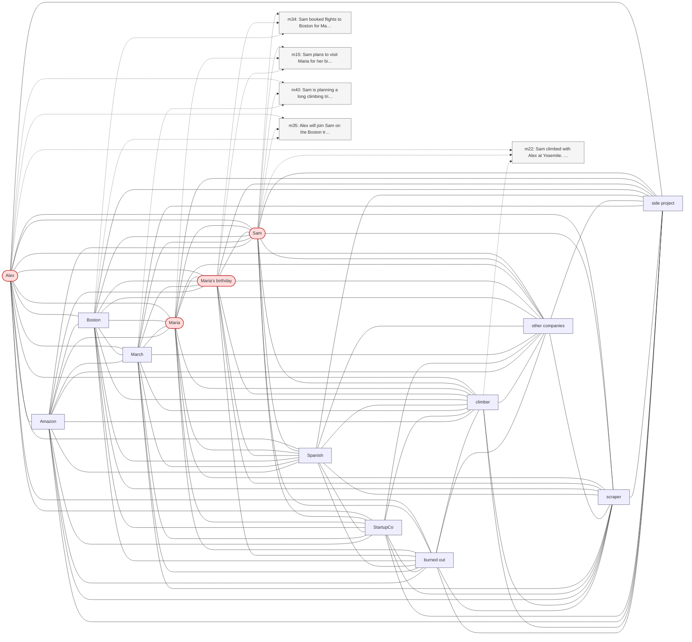

# Trace — q17  [compositional_aggregation, expect=HippoRAG]

**Question:** Who are all the people Sam has mentioned in conversations?

**Expected answer:** Alex (partner), Jennifer (old manager), Maria (mother), David (brother), Marcus (new manager)

**Required facts:** ['m03', 'm05', 'm11', 'm13', 'm28']

## Step 1 — query→triple top-K (cosine on triple-text embeddings)

| Cosine | Subject | Predicate | Object |
|---|---|---|---|
| 0.412 | `Sam` | uses | `Duolingo` |
| 0.407 | `Sam` | interviewed at | `developer-tools startups` |
| 0.402 | `Sam` | is planning trip with | `Alex` |
| 0.393 | `Sam` | is planning trip to | `Joshua Tree` |
| 0.391 | `Sam` | is going to be there for | `Maria's birthday` |
| 0.381 | `Yosemite` | was visited by | `Sam` |
| 0.378 | `Sam` | plans to visit | `Maria` |
| 0.377 | `Sam` | climbed with | `Alex` |
| 0.377 | `Sam` | is planning trip in | `March` |
| 0.374 | `Sam` | has manager | `Jennifer` |

## Step 2 — recognition memory (LLM filter)

| Subject | Predicate | Object |
|---|---|---|
| `Sam` | is planning trip with | `Alex` |
| `Sam` | is going to be there for | `Maria's birthday` |
| `Sam` | plans to visit | `Maria` |
| `Sam` | climbed with | `Alex` |

## Step 3 — top 5 retrieved passages

| Rank | Memory | PPR | Hit | Text |
|---|---|---|---|---|
| 1 | `m34` | 0.00315 |  | Sam booked flights to Boston for May 13 through 17 to be the… |
| 2 | `m15` | 0.00292 |  | Sam plans to visit Maria for her birthday in mid-May. |
| 3 | `m40` | 0.00276 |  | Sam is planning a long climbing trip to Joshua Tree in late … |
| 4 | `m22` | 0.00273 |  | Sam climbed with Alex at Yosemite. Alex is also a climber bu… |
| 5 | `m35` | 0.00239 |  | Alex will join Sam on the Boston trip. |

## Search subgraph

Seeds from filtered triples (red), top-PPR phrases (blue), top-5 passage nodes (green if required, grey otherwise).

