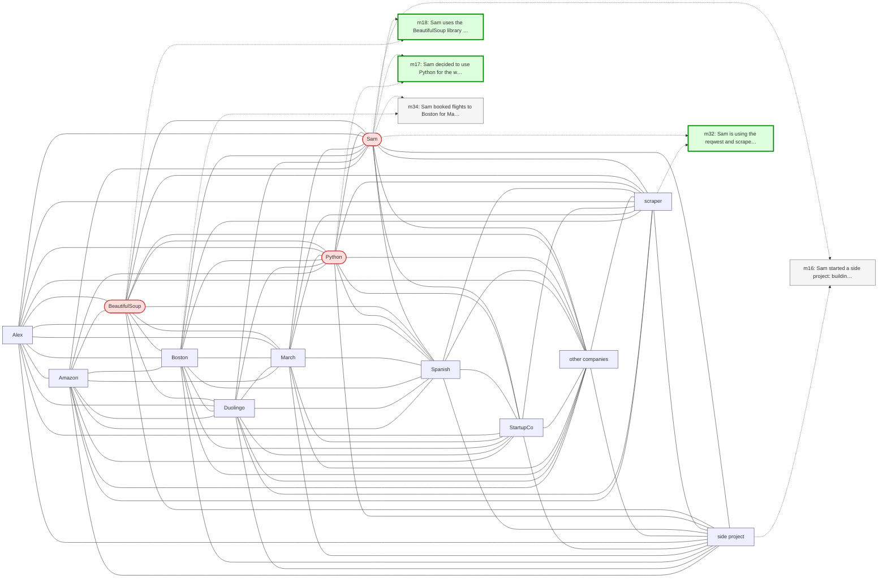

# Trace — q18  [compositional_aggregation, expect=HippoRAG]

**Question:** What different programming languages and libraries has Sam used or learned?

**Expected answer:** Python, BeautifulSoup, Rust, reqwest, scraper

**Required facts:** ['m17', 'm18', 'm30', 'm32']

## Step 1 — query→triple top-K (cosine on triple-text embeddings)

| Cosine | Subject | Predicate | Object |
|---|---|---|---|
| 0.560 | `Sam` | uses | `Duolingo` |
| 0.544 | `Sam` | worked on | `web scraper project` |
| 0.507 | `Sam` | uses | `BeautifulSoup` |
| 0.483 | `Sam` | is | `software engineer` |
| 0.483 | `Sam` | decided to use | `Python` |
| 0.479 | `Sam` | uses | `scraper` |
| 0.466 | `Sam` | practices | `Spanish` |
| 0.466 | `Sam` | practices | `Spanish` |
| 0.460 | `Sam` | has favorite climbing problems | `V4-V5 boulder routes` |
| 0.456 | `Sam` | started learning Spanish | `two months ago` |

## Step 2 — recognition memory (LLM filter)

| Subject | Predicate | Object |
|---|---|---|
| `Sam` | decided to use | `Python` |
| `Sam` | uses | `BeautifulSoup` |

## Step 3 — top 5 retrieved passages

| Rank | Memory | PPR | Hit | Text |
|---|---|---|---|---|
| 1 | `m18` | 0.00317 | ✓ | Sam uses the BeautifulSoup library for parsing HTML in the s… |
| 2 | `m17` | 0.00298 | ✓ | Sam decided to use Python for the web scraper project. |
| 3 | `m32` | 0.00281 | ✓ | Sam is using the reqwest and scraper crates for the Rust ver… |
| 4 | `m34` | 0.00274 |  | Sam booked flights to Boston for May 13 through 17 to be the… |
| 5 | `m16` | 0.00268 |  | Sam started a side project: building a web scraper to find n… |

## Search subgraph

Seeds from filtered triples (red), top-PPR phrases (blue), top-5 passage nodes (green if required, grey otherwise).

