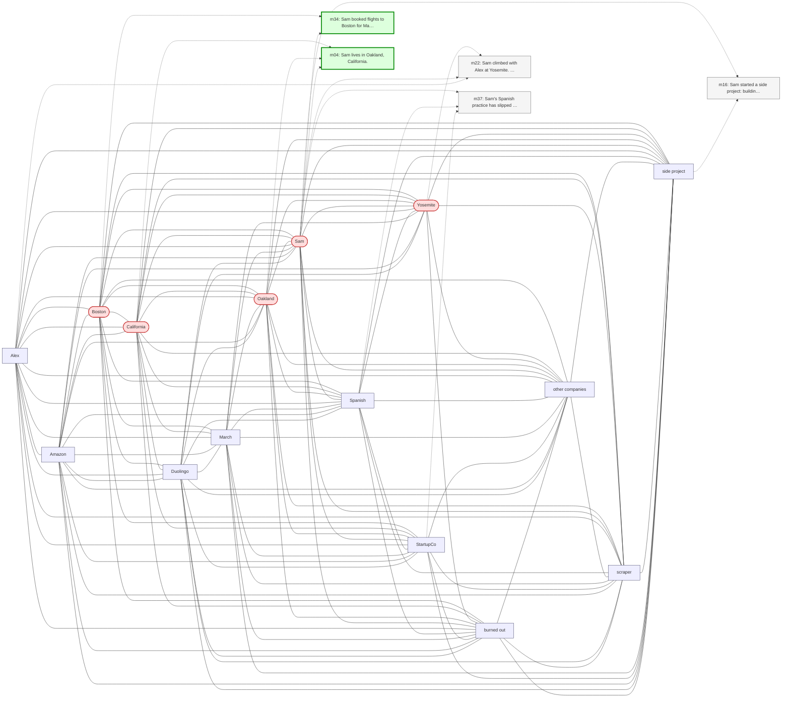

# Trace — q19  [compositional_aggregation, expect=HippoRAG]

**Question:** What places does Sam have travel or residence connections to?

**Expected answer:** Oakland (lives), San Francisco (work), Boston (mother + planned trip), Seattle (brother), Yosemite (climbed), Joshua Tree (planned trip), Mexico (Spanish learning motivation)

**Required facts:** ['m02', 'm04', 'm06', 'm11', 'm13', 'm21', 'm34', 'm40']

## Step 1 — query→triple top-K (cosine on triple-text embeddings)

| Cosine | Subject | Predicate | Object |
|---|---|---|---|
| 0.439 | `Yosemite` | was visited by | `Sam` |
| 0.439 | `Sam` | lives in | `Oakland` |
| 0.439 | `Sam` | lives in | `California` |
| 0.438 | `Sam` | booked flights to | `Boston` |
| 0.426 | `Sam` | climbed at | `Yosemite` |
| 0.422 | `Sam` | uses | `Duolingo` |
| 0.422 | `Sam` | went climbing at | `Berkeley Ironworks` |
| 0.416 | `Sam` | has goal | `discover new outdoor climbing destinations` |
| 0.406 | `Sam` | will travel to | `Boston` |
| 0.403 | `Sam` | works at | `StartupCo` |

## Step 2 — recognition memory (LLM filter)

| Subject | Predicate | Object |
|---|---|---|
| `Yosemite` | was visited by | `Sam` |
| `Sam` | lives in | `Oakland` |
| `Sam` | lives in | `California` |
| `Sam` | booked flights to | `Boston` |

## Step 3 — top 5 retrieved passages

| Rank | Memory | PPR | Hit | Text |
|---|---|---|---|---|
| 1 | `m34` | 0.00298 | ✓ | Sam booked flights to Boston for May 13 through 17 to be the… |
| 2 | `m04` | 0.00272 | ✓ | Sam lives in Oakland, California. |
| 3 | `m22` | 0.00270 |  | Sam climbed with Alex at Yosemite. Alex is also a climber bu… |
| 4 | `m16` | 0.00232 |  | Sam started a side project: building a web scraper to find n… |
| 5 | `m37` | 0.00230 |  | Sam's Spanish practice has slipped to once a week since star… |

## Search subgraph

Seeds from filtered triples (red), top-PPR phrases (blue), top-5 passage nodes (green if required, grey otherwise).

