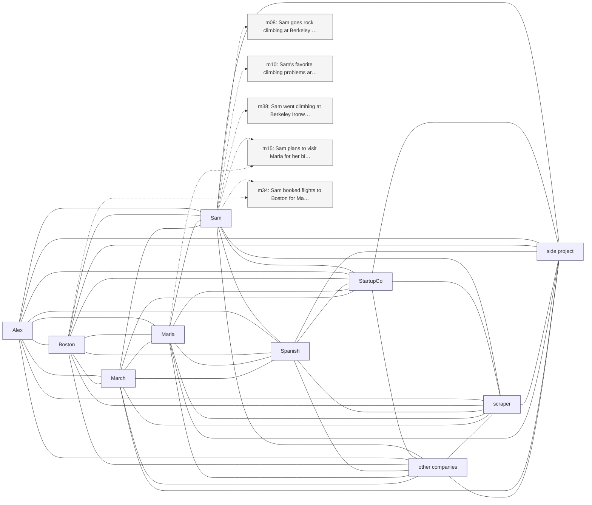

# Trace — q20  [absence_abstention, expect=tie]

**Question:** What is Sam's favorite food?

**Expected answer:** unknown / not mentioned

**Required facts:** (none — absence/abstention)

## Step 1 — query→triple top-K (cosine on triple-text embeddings)

| Cosine | Subject | Predicate | Object |
|---|---|---|---|
| 0.429 | `Sam` | has favorite climbing problems | `V4-V5 boulder routes` |
| 0.414 | `Sam` | practices | `Spanish` |
| 0.414 | `Sam` | practices | `Spanish` |
| 0.414 | `Sam` | uses | `Duolingo` |
| 0.403 | `Sam` | climbed at | `Yosemite` |
| 0.400 | `Sam` | goes rock climbing at | `Berkeley Ironworks` |
| 0.398 | `Sam` | is learning | `Spanish` |
| 0.396 | `Sam` | went climbing at | `Berkeley Ironworks` |
| 0.387 | `Yosemite` | was visited by | `Sam` |
| 0.385 | `Sam` | started learning Spanish | `two months ago` |

## Step 2 — recognition memory (LLM filter)

_(LLM kept no triples)_

## Step 3 — top 5 retrieved passages

| Rank | Memory | PPR | Hit | Text |
|---|---|---|---|---|
| 1 | `m08` | 0.00759 |  | Sam goes rock climbing at Berkeley Ironworks gym. |
| 2 | `m10` | 0.00691 |  | Sam's favorite climbing problems are V4-V5 boulder routes. |
| 3 | `m38` | 0.00666 |  | Sam went climbing at Berkeley Ironworks this morning, first … |
| 4 | `m15` | 0.00627 |  | Sam plans to visit Maria for her birthday in mid-May. |
| 5 | `m34` | 0.00624 |  | Sam booked flights to Boston for May 13 through 17 to be the… |

## Search subgraph

Seeds from filtered triples (red), top-PPR phrases (blue), top-5 passage nodes (green if required, grey otherwise).

