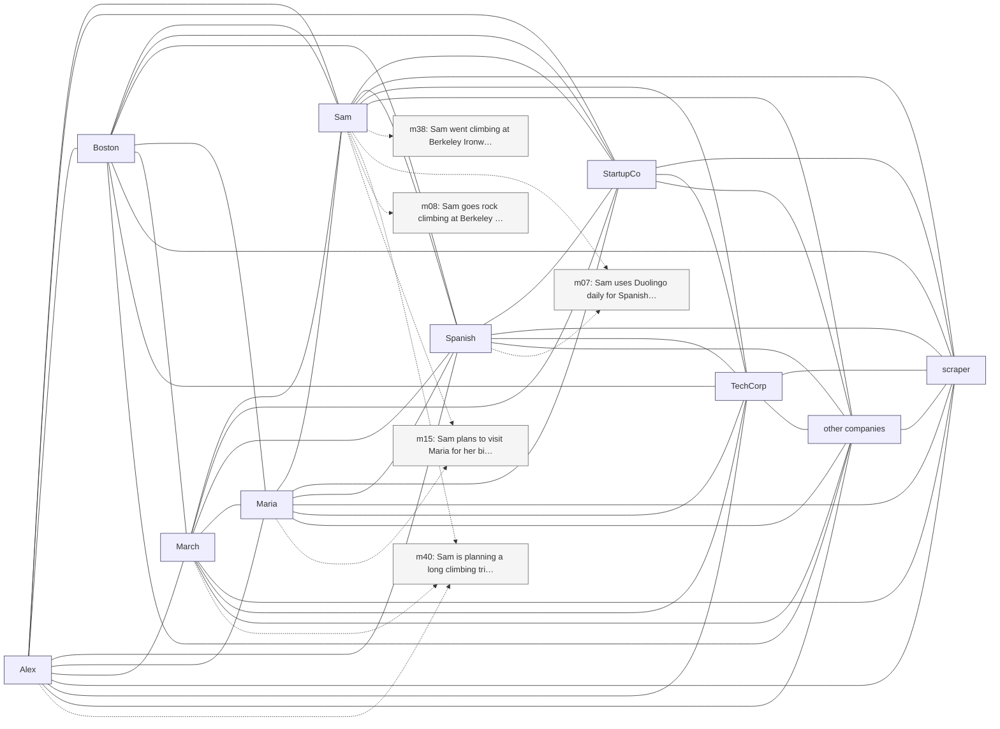

# Trace — q21  [absence_abstention, expect=tie]

**Question:** Does Sam have any pets?

**Expected answer:** unknown / not mentioned

**Required facts:** (none — absence/abstention)

## Step 1 — query→triple top-K (cosine on triple-text embeddings)

| Cosine | Subject | Predicate | Object |
|---|---|---|---|
| 0.441 | `Sam` | uses | `Duolingo` |
| 0.440 | `Sam` | has partner | `Alex` |
| 0.439 | `Sam` | practices | `Spanish` |
| 0.439 | `Sam` | practices | `Spanish` |
| 0.427 | `Sam` | has been doing | `rock climbing` |
| 0.424 | `Sam` | lives in | `Oakland` |
| 0.421 | `Sam` | has manager | `Jennifer` |
| 0.415 | `Sam` | has mother | `Maria` |
| 0.411 | `Sam` | went climbing at | `Berkeley Ironworks` |
| 0.407 | `Sam` | climbed at | `Yosemite` |

## Step 2 — recognition memory (LLM filter)

_(LLM kept no triples)_

## Step 3 — top 5 retrieved passages

| Rank | Memory | PPR | Hit | Text |
|---|---|---|---|---|
| 1 | `m08` | 0.00763 |  | Sam goes rock climbing at Berkeley Ironworks gym. |
| 2 | `m38` | 0.00697 |  | Sam went climbing at Berkeley Ironworks this morning, first … |
| 3 | `m40` | 0.00623 |  | Sam is planning a long climbing trip to Joshua Tree in late … |
| 4 | `m07` | 0.00622 |  | Sam uses Duolingo daily for Spanish practice. |
| 5 | `m15` | 0.00619 |  | Sam plans to visit Maria for her birthday in mid-May. |

## Search subgraph

Seeds from filtered triples (red), top-PPR phrases (blue), top-5 passage nodes (green if required, grey otherwise).

