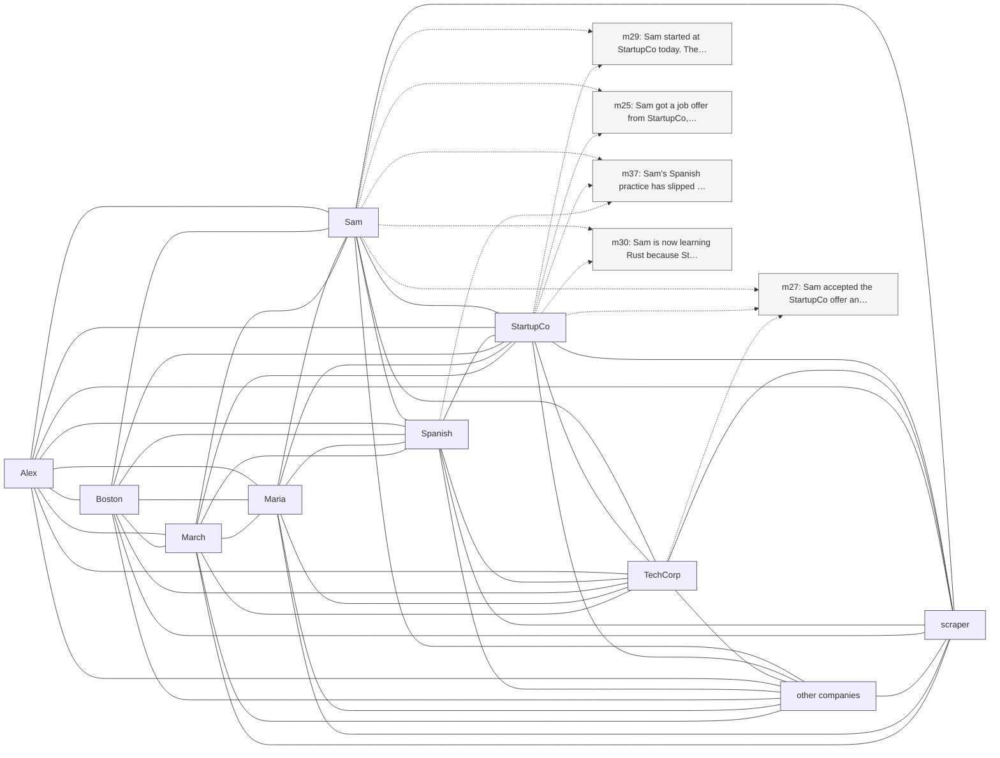

# Trace — q22  [absence_abstention, expect=tie]

**Question:** What is Sam's salary at StartupCo?

**Expected answer:** unknown / not mentioned

**Required facts:** (none — absence/abstention)

## Step 1 — query→triple top-K (cosine on triple-text embeddings)

| Cosine | Subject | Predicate | Object |
|---|---|---|---|
| 0.619 | `Sam` | works at | `StartupCo` |
| 0.619 | `Sam` | works at | `StartupCo` |
| 0.589 | `Sam` | accepted offer from | `StartupCo` |
| 0.582 | `Sam` | started at | `StartupCo` |
| 0.573 | `Sam` | received job offer from | `StartupCo` |
| 0.493 | `Sam` | works at | `TechCorp` |
| 0.493 | `Sam` | works at | `TechCorp` |
| 0.493 | `Sam` | works at | `TechCorp` |
| 0.476 | `StartupCo` | based in | `San Francisco` |
| 0.444 | `Sam` | gave notice at | `TechCorp` |

## Step 2 — recognition memory (LLM filter)

_(LLM kept no triples)_

## Step 3 — top 5 retrieved passages

| Rank | Memory | PPR | Hit | Text |
|---|---|---|---|---|
| 1 | `m29` | 0.00766 |  | Sam started at StartupCo today. The role is senior backend e… |
| 2 | `m25` | 0.00746 |  | Sam got a job offer from StartupCo, a developer-tools startu… |
| 3 | `m27` | 0.00741 |  | Sam accepted the StartupCo offer and gave notice at TechCorp… |
| 4 | `m37` | 0.00732 |  | Sam's Spanish practice has slipped to once a week since star… |
| 5 | `m30` | 0.00707 |  | Sam is now learning Rust because StartupCo's main service is… |

## Search subgraph

Seeds from filtered triples (red), top-PPR phrases (blue), top-5 passage nodes (green if required, grey otherwise).

